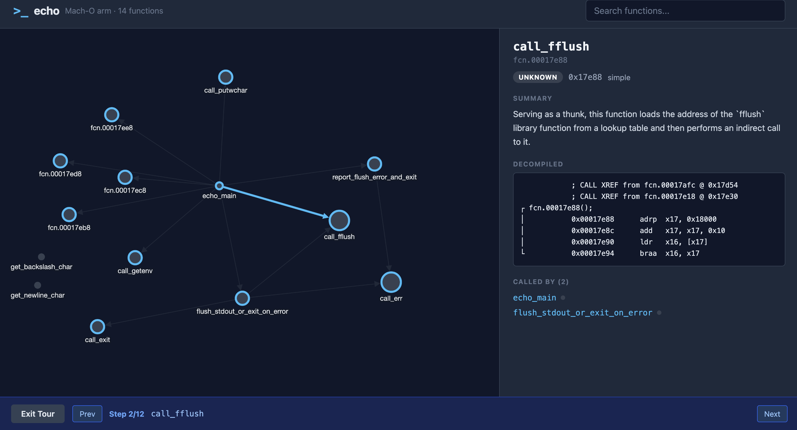

# Understand-Binary

**Turn stripped binaries into interactive knowledge graphs.**

Understand-Binary analyzes compiled executables — even without source code or debug symbols — and produces a navigable, visual knowledge graph. LLM-powered agents infer function names, generate summaries, classify architectural layers, and build guided walkthroughs.

```
$ understand-binary ./sqlite3

Loading binary... ELF x86_64, 242 functions
Running agents...
  ✓ function-namer:    187/242 functions named
  ✓ layer-classifier:  6 layers detected
  ✓ summarizer:        242 summaries generated
  ✓ tour-builder:      15-step walkthrough created

Viewer ready at http://localhost:3000
```



## How It Works

Four agents analyze the binary through a plugin pipeline:

| Agent | What it does |
|---|---|
| **function-namer** | Infers meaningful names for stripped `sub_XXXXX` functions using LLM |
| **layer-classifier** | Categorizes functions into layers (network, crypto, IO, math, etc.) via heuristics + LLM fallback |
| **summarizer** | Generates plain-English descriptions of each function |
| **tour-builder** | Creates a guided walkthrough from entry point through the call graph |

## Architecture

```
Binary ──→ Loader (rizin) ──→ BinaryContext
                                    │
                    ┌─ function-namer ─┐
                    │                   ├──→ summarizer ──→ tour-builder
                    └─ layer-classifier─┘
                                    │
                              KnowledgeGraph (JSON)
                                    │
                              React Viewer (Cytoscape.js)
```

**Plugin system:** Both loaders and agents are auto-discovered. Drop a Python file in `src/loaders/` or `src/agents/` — no config needed.

## Installation

```bash
# Clone
git clone https://github.com/YOUR_USERNAME/understand-binary.git
cd understand-binary

# Python backend
pip install -e .

# React viewer
cd src/viewer && npm install && npm run build && cd ../..

# Verify
understand-binary --help
```

**Requirements:** Python 3.10+, Node.js 18+, [rizin](https://rizin.re/) installed and on PATH.

### LLM setup

The default provider is **Gemini**. Get a free API key at [aistudio.google.com](https://aistudio.google.com) and add it to a `.env` file in the project root:

```
GEMINI_API_KEY=your_key_here
```

The tool loads `.env` automatically. You can also export the key as an environment variable instead.

To use a different provider, pass `--llm-provider`:

| Provider | Env var | Default model |
|---|---|---|
| `gemini` (default) | `GEMINI_API_KEY` | `gemini-2.5-flash` |
| `openai` | `OPENAI_API_KEY` | `gpt-4o` |
| `ollama` | *(none)* | `llama3` |

## Usage

```bash
# Basic — analyze and open viewer in browser (port 3000)
understand-binary ./mybinary

# JSON output only, no browser
understand-binary ./mybinary --no-viewer

# Custom output directory
understand-binary ./mybinary --output ./my-output

# Use a local LLM via Ollama
understand-binary ./mybinary --llm-provider ollama --llm-model llama3

# Run specific agents only
understand-binary ./mybinary --agents function-namer,summarizer

# Custom viewer port
understand-binary ./mybinary --port 8080

# Verbose mode (shows per-agent progress)
understand-binary ./mybinary --verbose
```

The viewer is served as a local HTTP server — it copies the `knowledge-graph.json` into `src/viewer/dist/` and opens `http://localhost:3000` in your browser automatically. Press `Ctrl+C` to stop.

### View an existing graph without re-running analysis

If you've already run the analysis and just want to reopen the viewer:

```bash
cp .understand-binary/knowledge-graph.json src/viewer/dist/
python3 -m http.server 3000 --directory src/viewer/dist
```

Then open http://localhost:3000 in your browser.

## Extending

### Add an agent

Create `src/agents/crypto_detector.py`:

```python
from src.agents.base import Agent
from src.core.graph import GraphFragment, KnowledgeGraph, Node
from src.core.llm import LLMClient
from src.loaders.base import BinaryContext

class CryptoDetectorAgent(Agent):
    name = "crypto-detector"
    description = "Detect cryptographic algorithms by constant patterns"
    depends_on = []

    def analyze(self, context: BinaryContext, graph: KnowledgeGraph, llm: LLMClient) -> GraphFragment:
        fragment = GraphFragment()
        # Your analysis logic here
        return fragment
```

That's it. The orchestrator picks it up automatically.

### Add a loader

Create `src/loaders/ghidra_loader.py`:

```python
from src.loaders.base import BinaryLoader, BinaryContext

class GhidraLoader(BinaryLoader):
    name = "ghidra"
    supported_formats = ["ELF", "PE", "Mach-O"]

    def load(self, path: str) -> BinaryContext:
        # Your Ghidra integration here
        ...

    def decompile(self, address: str) -> str:
        # Use Ghidra's decompiler
        ...
```

## Tech Stack

- **Python** — orchestrator, agents, plugin system, CLI
- **rizin + rzpipe** — binary loading, disassembly, decompilation
- **Gemini / OpenAI / Ollama** — default is Gemini 2.5 Flash via OpenAI-compatible shim; any provider works
- **React + TypeScript** — viewer frontend
- **Cytoscape.js** — force-directed graph visualization
- **Fuse.js** — fuzzy search
- **Prism.js** — syntax highlighting for decompiled C

## Roadmap

- [x] v0.1 — Core pipeline, 4 agents, interactive viewer
- [ ] v0.2 — Vulnerability scanner agent, crypto detector agent
- [ ] v0.3 — Basic block and instruction-level tour (zoom into assembly)
- [ ] v0.4 — Binary diffing (compare two versions)
- [ ] v0.5 — Firmware blob support (binwalk integration)
- [ ] v0.6 — Ghidra loader for better decompilation

## Contributing

1. Fork the repo
2. Create a feature branch
3. Add your agent or loader (see Extending above)
4. Submit a PR

## License

MIT